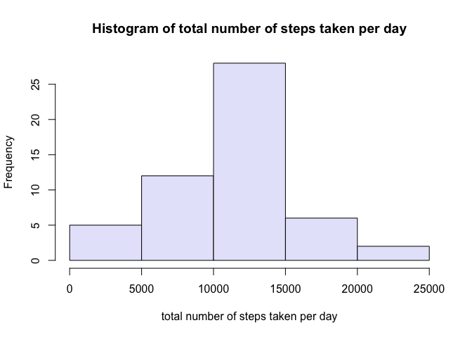
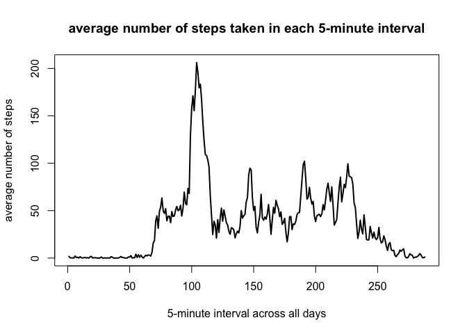
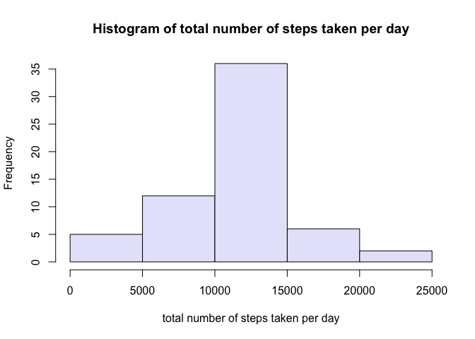
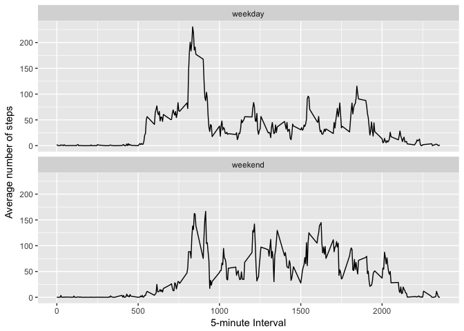

# Reproducible Research: Peer Assessment 1


## Introduction

It is now possible to collect a large amount of data about personal movement using activity monitoring devices such as a [Fitbit](https://www.fitbit.com/nl/home), [Nike Fuelband](http://www.nike.com/nl/nl_nl/c/nikeplus-fuelband), or [Jawbone Up](https://jawbone.com/up). These type of devices are part of the “quantified self” movement – a group of enthusiasts who take measurements about themselves regularly to improve their health, to find patterns in their behavior, or because they are tech geeks. But these data remain under-utilized both because the raw data are hard to obtain and there is a lack of statistical methods and software for processing and interpreting the data.

This assignment makes use of data from a personal activity monitoring device. This device collects data at 5 minute intervals through out the day. The data consists of two months of data from an anonymous individual collected during the months of October and November, 2012 and include the number of steps taken in 5 minute intervals each day.

The variables included in the dataset are: 

**steps**: Number of steps taking in a 5-minute interval (missing values are coded as <span style="color:red">NA</span>)  
**date**: The date on which the measurement was taken in YYYY-MM-DD format  
**interval**: Identifier for the 5-minute interval in which measurement was taken  

The dataset is stored in a comma-separated-value (CSV) file and there are a total of 17,568 observations in this dataset.

## Assignment

### Loading and preprocessing the data  
Show any code that is needed to

1. Load the data  

```r
library(ggplot2)
library(plyr)
activity <- read.csv("./activity.csv")
```

2. Process/transform the data (if necessary) into a format suitable for your analysis

```r
activity$date <- as.Date(activity$date, "%Y-%m-%d")
```

### What is mean total number of steps taken per day?
For this part of the assignment, you can ignore the missing values in the dataset.

1. Calculate the total number of steps taken per day

```r
activity_total_steps_daily <- ddply(activity, .(date), function(x) sum(x$steps))
colnames(activity_total_steps_daily)[2] <- "total steps per day"
```

2. Make a histogram of the total number of steps taken each day

```r
hist(activity_total_steps_daily[,2], main = "Histogram of total number of steps taken per day", 
     xlab = "total number of steps taken per day", col = "lavender")
```

<!-- -->

3. Calculate and report the mean and median of the total number of steps taken per day

```r
mean(activity_total_steps_daily$`total steps per day`, na.rm = TRUE)
```

```
## [1] 10766.19
```

```r
median(activity_total_steps_daily$`total steps per day`, na.rm = TRUE)
```

```
## [1] 10765
```

### What is the average daily activity pattern?  
1. Make a time series plot (i.e. <span style="color:red">type = "l"</span>) of the 5-minute interval (x-axis) and the average number of steps taken, averaged across all days (y-axis)

```r
activity_mean_steps_daily <- ddply(activity, .(interval), function(x) mean(x$steps, na.rm = TRUE))
colnames(activity_mean_steps_daily)[2] <- "mean steps per interval"
plot(activity_mean_steps_daily$`mean steps per interval`, type = "l", main = "average number of steps taken in each 5-minute interval", xlab = "5-minute interval across all days", ylab = "average number of steps", lwd = 2)
```

<!-- -->

2. Which 5-minute interval, on average across all the days in the dataset, contains the maximum number of steps?

```r
activity_mean_steps_daily[which.max(activity_mean_steps_daily$`mean steps per interval`),]
```

```
##     interval mean steps per interval
## 104      835                206.1698
```

### Imputing missing values
Note that there are a number of days/intervals where there are missing values (coded as <span style="color:red">NA</span>). The presence of missing days may introduce bias into some calculations or summaries of the data.

1. Calculate and report the total number of missing values in the dataset

```r
sum(!complete.cases(activity))
```

```
## [1] 2304
```

2. Fill in all of the missing values in the dataset by using the **mean** for that 5-minute interval.
3. Create a new dataset that is equal to the original dataset but with the missing data filled in.

```r
activity_imput_na <- activity
for(i in 1:nrow(activity_imput_na)) {
    int <- activity_imput_na$interval[i]
    activity_imput_na$steps[i][is.na(activity_imput_na$steps[i])] <- activity_mean_steps_daily$`mean steps per interval`[which(activity_mean_steps_daily$interval == int)] 
}
```

4. Make a histogram of the total number of steps taken each day and Calculate 

```r
activity_total_steps_daily_na <- ddply(activity_imput_na, .(date), function(x) sum(x$steps))
colnames(activity_total_steps_daily_na)[2] <- "total steps per day"
hist(activity_total_steps_daily_na[,2], main = "Histogram of total number of steps taken per day", xlab = "total number of steps taken per day", col = "lavender")
```

<!-- -->

Report the mean and median total number of steps taken per day. Do these values differ from the estimates from the first part of the assignment? What is the impact of imputing missing data on the estimates of the total daily number of steps?

```r
mean(activity_total_steps_daily_na$`total steps per day`, na.rm = TRUE)
```

```
## [1] 10766.19
```

```r
median(activity_total_steps_daily_na$`total steps per day`, na.rm = TRUE)
```

```
## [1] 10766.19
```

After imputation of missing values, the mean remains the same, but there is little difference in the median. The impact is not that big/obvious.

### Are there differences in activity patterns between weekdays and weekends?

1. Create a new factor variable in the dataset with two levels – “weekday” and “weekend” indicating whether a given date is a weekday or weekend day.

```r
activity_imput_na$day <- c("weekday")
wd <- weekdays(activity_imput_na$date)
for(i in 1:nrow(activity_imput_na)){
    if(wd[i] == "Saturday" || wd[i] == "Sunday"){
        activity_imput_na$day[i] <- "weekend"
    }
}
```

2. Make a panel plot containing a time series plot (i.e. <span style="color:red">type = "l"</span>) of the 5-minute interval (x-axis) and the average number of steps taken, averaged across all weekday days or weekend days (y-axis). See the **README file** in the GitHub repository to see an example of what this plot should look like using simulated data.

```r
activity_total_steps_interval_na <- ddply(activity_imput_na, .(interval, day), function(x) mean(x$steps))
colnames(activity_total_steps_interval_na)[3] <- "mean steps per interval"

qplot(interval, `mean steps per interval`, data = activity_total_steps_interval_na, geom = c("line"), 
      xlab = "5-minute Interval", ylab = "Average number of steps") + facet_wrap(~day, ncol = 1)
```

<!-- -->
